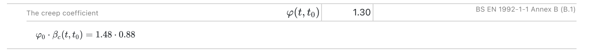

# Enjicalc templates 

The goal of the project is to develop a library of engineering calculations that will later be hosted on a free-to-use version of the Enjicalc web application. 

You can either contribute to the engineering community and push requests to this repository, or fork it to your organisation's account, where later you will be able to host your calcs on enterprise version of Enjicalc.  

You can also upload excel files, which you would want to see open-source, in the discussion section or send them to viktar@silael.com. Make sure to include a brief explanation of what the spreadsheet does! 

<image 
    height="200"
    width="auto" 
    alt="enji" 
    src="beta_h.jpg">

## Project dependencies

The project is built using python standard libraries, where PyTest is the only external library you need to install to run tests. [Clone](https://docs.github.com/en/repositories/creating-and-managing-repositories/cloning-a-repository) the project to your machine. Install [virtual environment](https://docs.python.org/3/tutorial/venv.html) and pytest dependency by running the following command:  

Windows: 
```console
python -m venv .venv\enjicalc && .venv\enjicalc\Scripts\activate && pip install -r requirements.txt
```

macOS/Linux:
```console
python -m venv .venv/enjicalc && source .venv/enjicalc/bin/activate && pip install -r requirements.txt
```

Once cloned, run the ```pytest``` command to make sure everything is working and you are ready to go! 

## Contacts 

If you have any questions, please feel free to send an email to viktar@silael.com, or raise a question on the discussion page on GitHub.

You can also book a 30 min chat with Silael founders using [calendly](https://calendly.com/viktarb).

## Table of contents

- [Enjicalc templates](#enjicalc-templates)
  - [Project dependencies](#project-dependencies)
  - [Contacts](#contacts)
  - [Table of contents](#table-of-contents)
  - [Templates folder structure](#templates-folder-structure)
  - [Introduction to Enjicalc template architecture](#introduction-to-enjicalc-template-architecture)
  - [Defining variable name with Latex](#defining-variable-name-with-latex)
  - [Input and secondary input](#input-and-secondary-input)
  - [Console commands](#console-commands)
  - [FAQ](#faq)
    - [When Enjicalc will be released?](#when-enjicalc-will-be-released)
    - [Will I need to pay to have an access to templates on Enjicalc?](#will-i-need-to-pay-to-have-an-access-to-templates-on-enjicalc)
    - [I don't code, can I still contribute?](#i-dont-code-can-i-still-contribute)
    - [Will I be able to only define formulae and constants components in Enjicalc?](#will-i-be-able-to-only-define-formulae-and-constants-components-in-enjicalc)
    - [What functions are available?](#what-functions-are-available)

## Templates folder structure

For every new template, a folder should be created. This is done to store the {template_name}_evaluated.json and {template_name}_enjicalc_render.json in the same location. Once the folder is created, copy the [Enjicalc standard template](templates/enjicalc_standard_template.json) and name JSON file the same way you named your folder. Before you start working on your calculations, the folder structure should look like this: 

```
templates
│
└───{template_name}
    │   {template_name}.json
```

During the development, you can verify that all your formulae are correct by using the command below: 

```console
python src\enji_verifier.py 'json_relative_path'
```

To create a JSON template solution, use the command below. The file will be located in the same folder as a template.  

```console
python src\enji_solver.py 'json_relative_path'
```

Your folder will have the following structure: 

```
templates
│
└───{template_name}
    │   {template_name}.json
    │   {template_name}_evaluted.json
```

An example of how your folder will look like can be found [here](tests/test_cli).

Once a template is ready to be reviewed, raise a new discussion with a template name you want to generate or send an email to viktar@silael. We will check your template and we will produce the pdf file with rendered version of the template. We will also will upload your pdf calcs to the appropriate folder, where the final structure will look like this: 

```
templates
│
└───{template_name}
    │   {template_name}.json
    │   {template_name}_evaluted.json
    │   {template_name}_rendered.json
```

## Introduction to Enjicalc template architecture

You can find an example of what Enjicalc is trying to achieve [here](tests\test_cli\creep_coefficient_ec2.json). At Silael, we are working towards perfecting the visual design of engineering calculations. Our goal is to make sure an engineer with any computer literacy level can read calculation documents like an open book. If you believe we can improve the design you saw earlier, let us know!

The templates are stored in a JSON file format. You can find an empty template example in a file [here](templates/enjicalc_standard_template.json). The most important part of the template is a variable component, an example of which you can find below. Please note, the "subheading" key is used to split the content on a page visually and it does not affect the calculations.

```json
{   
    "subheading": "",                               //optional
    "variable-name": "\\varphi(t,t_0)",
    "alias": "varphitt_0",
    "constant-formula": "varphi_0 * beta_ctt_0",
    "unit": "",                                     //optional
    "description": "The creep coefficient",         //optional
    "comment": "EN 1992-1-1 Annex B (B.1)"          //optional
}
```

LaTeX (pronounce LAH-tekh) template language is used to define a value of a "variable-name" key, which is later used to produce a visual representation of a formula defined in a "constant-formula" key. Latex is one of the most popular markup languages for formula editing and is widely used in academia for the communication and publication of scientific documents. [(Wikipedia)](https://en.wikipedia.org/wiki/LaTeX). 

Enjicalc builds fixed style templates, where an example of the creep coefficient component above is as follows:



While Latex is used to visually display content on a page, an alias is used to write a programming representation of an equation. This is because a majority of systems and programming languages only allow the use of English letters A..Z, a..z, digits 0..9 and the underscore character "_". The variable name, in most cases, also need to start with a letter character. 

In this project, an alias is defined by stripping the "variable-name" key and removing characters which are not allowed. This is to make sure the formulae is still readable by human beings involved in the development of templates.

Writing tip: 

To speed up writing formulae with aliases, make sure IntelliSense in your IDE suggests strings that were written before in your json. In VSCODE, the following is done by setting editor.quickSuggestions.strings to "True" in [settings.json file](https://code.visualstudio.com/docs/getstarted/settings#_settingsjson).

"Section", "unit", "description" and "comment" keys are optional and should be used to improve the readability of calculations. The quicker calcs can be reviewed, the better.

## Defining variable name with Latex 

The are several reasons why we are using Latex to define a variable name. First, defining subscripts and superscripts is extremely easy with latex. All you need to do is to wrap your subscript or superscript into curly braces " { } "and write underscore " _ " for subscript or caret " ^ " for superscript before the curly braces. You can find examples below. 

A_{s,xx} -> $A_{s,xx}$ 

L_{span,i}^{0.5} -> $L_{span,i}^{0.5}$ 

Note curly braces are only required when the number of characters you intend to use in superscript or subscript is bigger than 1. 

a^2_i -> $a^2_i$  

Another reason is the fact that greek letters in Latex can be defined using usual Latin letters. Or speaking computer science language, Latex defines greek letters using UTF-8 encoding, which is the most widespread encoding for electronic communications [(wiki)](https://en.wikipedia.org/wiki/UTF-8). You can find the full list of greek letters and how they are defined below. 

| Small Letter | Definition | Capital Letter | Definition |  Alternative  | Definition  |
| :----------: | :--------: | :------------: | :--------: | :-----------: | :---------: |
|   $\alpha$   |   \alpha   |      $A$       |     A      |               |             |
|   $\beta$    |   \beta    |      $B$       |     B      |               |             |
|   $\gamma$   |   \gamma   |    $\Gamma$    |   \Gamma   |               |             |
|   $\delta$   |   \delta   |    $\Delta$    |   \Delta   |               |             |
|  $\epsilon$  |  \epsilon  |      $E$       |     E      | $\varepsilon$ | \varepsilon |
|   $\zeta$    |   \zeta    |      $Z$       |     Z      |               |             |
|    $\eta$    |    \eta    |      $H$       |     H      |               |             |
|   $\theta$   |   \theta   |    $\Theta$    |   \Theta   |  $\vartheta$  |****  \vartheta  |
|   $\zeta$    |   \zeta    |      $I$       |     I      |               |             |
|   $\kappa$   |   \kappa   |      $K$       |     K      |  $\varkappa$  |  \varkappa  |
|  $\lambda$   |  \lambda   |   $\Lambda$    |  \Lambda   |               |             |
|    $\mu$     |    \mu     |      $M$       |     M      |               |             |
|    $\nu$     |    \nu     |      $N$       |     N      |               |             |
|    $\xi$     |    \xi     |     $\Xi$      |    \Xi     |               |             |
|  $\omicron$  |  \omicron  |      $O$       |     O      |               |             |
|    $\pi$     |    \pi     |     $\Pi$      |    \Pi     |   $\varpi$    |   \varpi    |
|    $\rho$    |    \rho    |      $P$       |     P      |   $\varrho$   |   \varrho   |
|   $\sigma$   |   \sigma   |    $\Sigma$    |   \Sigma   |  $\varsigma$  |  \varsigma  |
|    $\tau$    |    \tau    |      $T$       |     T      |               |             |
|  $\upsilon$  |  \upsilon  |   $\Upsilon$   |  \Upsilon  |               |             |
|    $\phi$    |    \phi    |     $\Phi$     |    \Phi    |   $\varphi$   |   \varphi   |
|    $\chi$    |    \chi    |      $X$       |     X      |               |             |
|    $\psi$    |    \psi    |     $\Psi$     |    \Psi    |               |             |
|   $\omega$   |   \omega   |    $\Omega$    |   \Omega   |               |             |

Finally, $\LaTeX$ is ***the language*** to work with mathematical formulae. If your job is to create a perfect equation that is very easy to read, $\LaTeX$ is your choice.

```Latex
\begin{align*}
    \int_0^2
        \left(
            -\frac{1}{4}\left(e^{-4t_1}+e^{4t_1-8}\right)
        \right)
    \,dt_1
\end{align*}
```

Is rendered as: 
$$
\begin{align*}
    \int_0^2
        \left(
            -\frac{1}{4}\left(e^{-4t_1}+e^{4t_1-8}\right)
        \right)
    \,dt_1
\end{align*}
$$

## Input and secondary input

TODO

## Console commands 

To run PyTest for the whole project, including developed templates, use the command below. 

```console
pytest
```

To verify a JSON template, use the command below. **Please note the command below is for Windows. Change the path notation to make sure it works on macOS**
```console
python src\enji_verifier.py 'json_relative_path'
```

To create a JSON template solution, use the command below. The file will be located in the same folder as a template.  

```console
python src\enji_solver.py 'json_relative_path'
```

## FAQ 

### When Enjicalc will be released? 

We are working very hard to start doing beta tests for Enjicalc. Be the first to know by subscribing to our waiting list at silael.com

### Will I need to pay to have an access to templates on Enjicalc?

We will be running two Enjicalc versions - one for paid users and one free-to-use. Free-to-use will be hosting templates you see in this repository, as well as providing some basic functionality that will mimic locked excel spreadsheets. Paid version will have advanced features to help our clients produce, manage, as well as collaborate on the production of calculations to support their business activity.  

### I don't code, can I still contribute? 

Yes, you can! You can still register with GitHub, follow the repository by pressing the watch button on top and star it.

You can also upload your excel files in the discussion section and ask any questions you want about the project.

If you want to start developing a template, go through the guide below to install all the tools required for the development.

1. Install IDE on your machine. Preferably [VSCODE](https://code.visualstudio.com/). Choose user installation to avoid the need for admin rights.
2. Install [GIT](https://git-scm.com/). 
3. Go through the guide "How to contribute to the GitHub project. [link](https://github.com/firstcontributions/first-contributions)

Once you complete these steps, you are ready to write templates! 

### Will I be able to only define formulae and constants components in Enjicalc? 

Our first step is to make sure constant and formula components can be easily defined and evaluated. This alone will help us replace most of the spreadsheets out there. Once we see a demand for further functionality, we will be introducing components like tables, figures (with support for vector graphics) and other  optimisation tools. 

### What functions are available?

The latest list of functions available can be found [in this file](src\ast_evaluator.py), in ```__eval_call``` function. If you believe there are other functions that you think are suitable, raise an issue in this repository with a function proposal.
